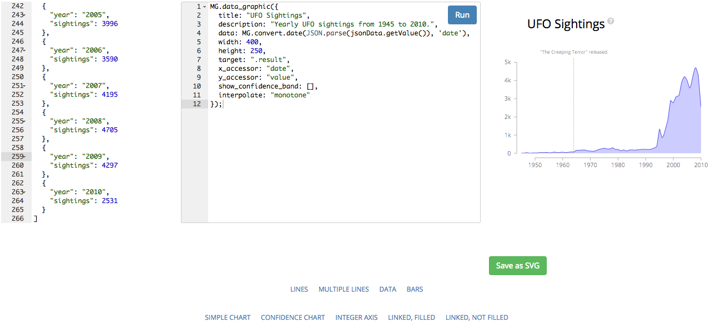

# Drag and Drop D3

* I wanted a library that allowed me to drag and drop json or csv data and get d3 graphs out.
* D3 is a pain in its raw form, but things like dimple.js and metricsgraphics.js make it a bit easier.
* However for quick simple visualisation it still wasnt everything. Google charts comes close but...... :(

* This is a small tool that is entirely client side for just this.
Drag json/csv files onto the data editor, at the bottom choose the graph type you want and (assuming that the data can be graphed) you will get a graph out.

* For example, choose 'LINES' at the bottom, then choose SIMPLE CHART. Then drag and drop the simple.json file into the data editor, and click run. You get a graph.
